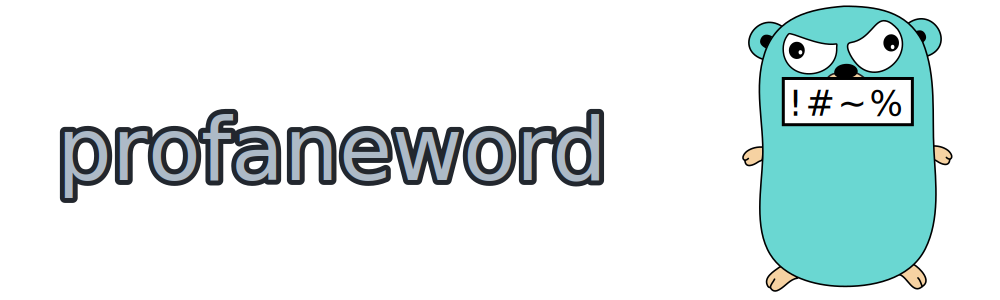

[](https://goreportcard.com/report/github.com/MikkelHJuul/profaneword)
[](https://pkg.go.dev/github.com/MikkelHJuul/profaneword)
[](https://codeclimate.com/github/MikkelHJuul/profaneword/maintainability)


profane password generator, as suggested by [u/gatestone](https://www.reddit.com/r/golang/comments/r5hn12/comment/hmnyk9k/?utm_source=share&utm_medium=web2x&context=3).
## how it works

install:

```bash
go install github.com/MikkelHJuul/profaneword/profaneword@latest
```
play
```bash 
❯ profaneword
Ad vs. Mean

~ 
❯ profaneword --extend
Dix Ogre - Pit

~ 
❯ profaneword --EXTEND
Enviousle Homicidally Lustillee Fuck'D Vs. Jerkass

~ 
❯ profaneword 1337
5uccum81n'? p4551v4710n-fuck3r!

~ 
❯ profaneword uber1337
|V@~/_| -> |V(_))3

~ 
❯ profaneword --extend /s
dimwitted? stIcKy PIrATes

~ 
❯ profaneword --extend randomly 1337 /s
DarEdEvils -> aDUlteRaTED p17Y-fuckR5

~ 
❯ profaneword --extend randomly random uber1337 /s
hOR2!B|3 3|V§|@\/eN, sEX-DEaTh!

~ 
❯ profaneword --extend SCREAM fst
SECLUSIO - UNFORIVING RCTM

~ 
❯ profaneword fat
Infertiliry-Fucker! Haram

~ 
❯ profaneword random fst whisper
badmoth'd - poopig

❯ profaneword randomly esrever
Tired noitavissap

~
❯ profaneword -d "_?"
Passivat'D_?Vs_?Hazile

~ 
❯ profaneword -d RAND
succumb?!.Infertile

~ 
❯ profaneword -d RAND
sissy+is+Excommunication


~ 
❯ profaneword --no MISSPELL
Awkwardly? sex-exacerbate!

❯ profaneword --help
profaneword is a CLI library and tool for generating obscene/profane passwords. 
It's probably not particularly safe to use, as these passwords will be easy to brute force; 
if an attacker knows you use this generator. But hey, it's just for fun.

Usage:
  profaneword [flags] [..args]
  profaneword [command]

Available Commands:
  completion  generate the autocompletion script for the specified shell
  help        Help about any command
  obscure     apply formatters on std in
  version     print the version and exit

Flags:
      --EXTEND                lengthen the output further (extensiveness+3)
  -d, --delimiter string      a specific delimiter to use, or 'RAND' for a randomly chosen one from: '.-/_:$%^+=!@'`,|<>"~\?*&' (default " ")
      --extend                lengthen the output (extensiveness+1)
  -e, --extensiveness int16   how long (number of words) the password should be. Default is 2 (default 2)
  -h, --help                  help for profaneword
      --no string             exclude types of words: can be MISSPELL, POSITIVE or a '|' separated text of those

Args[formatters]:
  1337            output formatted as 1337-speak
  uber1337        output formatted with an extended 1337 alphabet
  fat             output some t3xt wifth fat fringers
  fst             otput sme tet writen wit haste
  esrever         desrever tuptuo, per word; this cannot be coupled with 'random', functionality of 'random' will be ignored
  SCREAM          OUTPUT IS UPPERCASE
  whisper         output is lowercased
  /s              sARcaSTiC OUtpUt
	
  randomly        the next formatter is applied only randomly (per word basis) threshold is 50:50
  random          the next formatter is applied only randomly (per character basis) threshold is 50:50
                    both "random" and "randomly" are chainable onto themselves, 
                    though "randomly" must be before "random"


Use "profaneword [command] --help" for more information about a command.

~ 
```

all formatters available with obscure, examples
```

❯ echo DASDAD | profaneword obscure /s 
DasDad

~ 
❯ echo DASDAD | profaneword obscure 1337
D45D4D

```


## Statistics
The file [`data_report_test.go`](profanities/data_report_test.go) computes the number of combinations:

for...
* 1 word there will be 54.60 thousand combinations and on average 8.22 letters in each word
* 2 words there will be 6.25 billion combinations and on average 8.25 letters in each word
* 3 words there will be 715.97 trillion combinations and on average 8.25 letters in each word

These numbers refer to the database level

formatters: 
- `Title` is always ON, and virtually doubles the number of combinations
- `whisper` removes the combinations added by title.
- `SCREAM` adds 1 more combination of each word.
- `/s` increase combinations by a lot (`2^(8*n)` - the length of the word times number of words) `whisper` and `SCREAM` are special (very rare) combinations of `/s`
- `random/randomly` for `/s` it simply makes the uncommon possibilities a lot more common,
- `fat` and `fst` both increase the combinations by a lot. Again `random/randomly` just changes the distribution of the possible outcomes.
- `1337` adds one combination, `random 1337` adds a lot of combinations (`2^(~3*n)`). 
- `uber1337` adds many combinations, `random uber1337` adds a lot of combinations onto those. 
- using `--no MISSPELL` reduces combinations significantly.